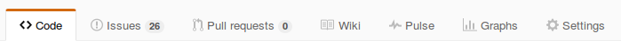
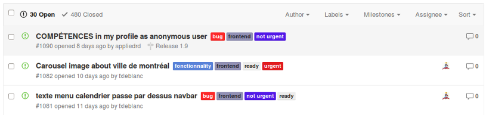
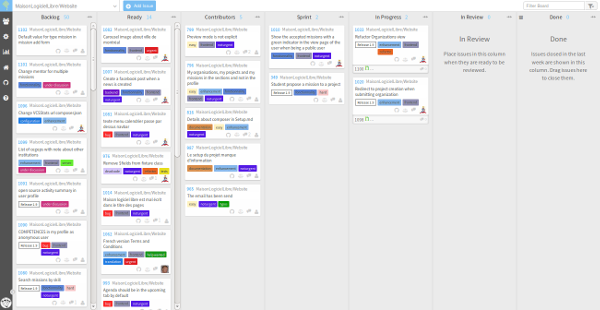
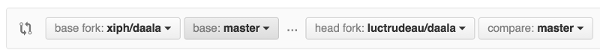
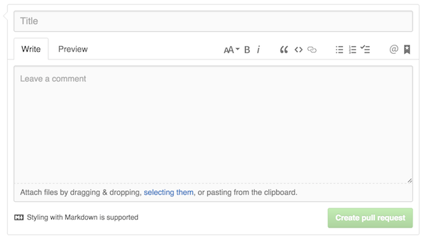

class: center, middle

# Contribuer avec Git:
## Comment contribuer à un projet en logiciel libre
### Noel Rignon
### Maison du logiciel libre
[](https://maisonlogiciellibre.org/)

<a href="https://github.com/maisonlogiciellibre/workshops"></a>

[](http://creativecommons.org/licenses/by-sa/4.0/)

---

## Nous allons introduire les concepts de bases pour vous permettre de:

1. Trouver les informations de contributions
2. Vous assignez une tâche
3. Tenir à jour votre fourche (fork)
4. Proposer vos modifications

---

# Étape 1: Vérifier les informations de contributions

### On commence par lire le README
Ce fichier permet de faire un tour d'horizon du projet et de relever des informations de base sur les process. (canal irc, mailing-list, gestionnaire de tickets, IDE, etc..)

### Bien souvent, les projets disposent d'un CONTRIBUTING.md
Ce fichier permet de trouver des informations sur les différentes manières de contribuer au projet. Et sur les attentes des administrateurs.

---

# Étape 1: Vérifier les informations de contributions

### Cependant beaucoup de projets ne prennent pas le temps d'écrire cette documentation
 - Prenez contact avec les administrateurs afin de ne pas perdre votre temps. 
 - Essayer de suivre au maximum la manière de coder actuellement présente.

---

# Étape 2: Trouver une tâche

### La plupart des projets utilisent un gestionnaire de ticket

Sur GitHub, le gestionnaire de ticket est très facile d'accès.



Note: Tous les projets présents sur Github n'utilisent pas forcément son gestionnaire de ticket.



---

# Étape 2: Trouver une tâche

### Certains projets utilisent des interfaces tierces



---

# Étape 3: Assignez-vous une tâche

### Avant toute chose, faites attention:

 - Avez-vous le temps de vous en occuper ?
 - Maitrisez-vous  la technologie ?
 - Êtes-vous à l'aise avec le projet en général ?

### La communauté va compter sur votre implication dans cette tâche

---

# Étape 4: Comprendre le flux de travail


---

# Étape 5: Tenir à jour votre fork

### Chaque branche doit être basée sur la version la plus à jour!

Cela évite les conflits et facilite l'intégration de votre code dans le projet

### Créons un lien distant nommé 'upstream' vers le dépôt officiel
```
git remote add upstream https://github.com/maisonlogiciellibre/workshops
```
### Et mettons à jour notre copie locale
```
git fetch upstream
```

---

# Étape 6: Effectuez vos changements

Note: Ces informations sont ici à titre d'exemple et varient selon le projet
### Créer votre branche de fonctionnalité
```
git checkout upstream dev
git checkout -b ma-nouvelle-branche
```

### Commiter vos changements

Une description de commit doit contenir:
* Un titre comme première ligne
* Une description du raisonnement derrière la modification contenue dans ce commit

---

# Étape 7: Effectuez un push

Attention: Ces changements sont locaux (uniquement sur votre machine)

###  Utilisez la commande push pour envoyer votre commit

```
git push origin ma-nouvelle-branche
```

---

# Étape 8: Proposer vos changements

### Sur la page de votre fork, vous pouvez maintenant créer un pull request à l'aide du bouton "Create Pull Request"

### Vous devez maintenant choisir la branche sur le projet original qui va tirer sur la branche dans votre fork.


---

# Étape 9: Proposer vos changements

### Par la suite, vous devez inclure un titre et une description à votre pull request

La description devrait contenir au minimum le numéro d'issue associé à votre tâche.



---

# Étape 10: Attendre

## Soyez patient

Le traitement de votre pull request peut prendre plusieurs jours.

---

# Étape 11: La réponse

## Votre contribution est acceptée

## Votre contribution est rejetée
### La réponse peut vous indiquer les correctifs à apporter à votre contribution pour que celle-ci soit acceptée.

---

# Exercice : Contribuer à FeastProject

Indice: Les issues offertes aux contributeurs sont dans la colonne: 'Contributors'

Le github du projet est [ici](https://github.com/savoirfairelinux/santropol-feast)

Est son waffle est [ici](https://waffle.io/savoirfairelinux/santropol-feast)

### Bonne Chance!

<a href="https://github.com/maisonlogiciellibre/workshops"></a>
