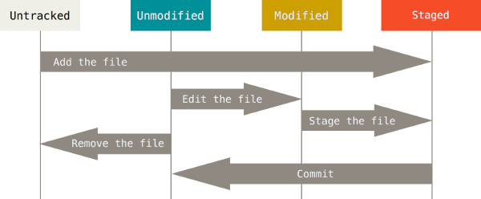
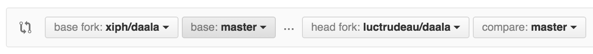
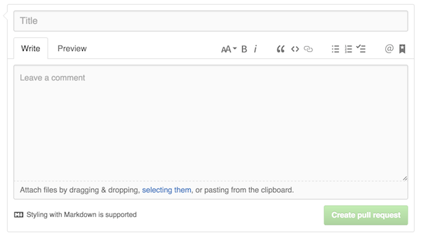

class: center, middle

# Introduction à Git:
## Les bases pour contribuer à un projet logiciel libre
### Luc Trudeau
### Maison du logiciel libre
[](https://maisonlogiciellibre.org/)

<a href="https://github.com/luctrudeau/Workshops/"></a>

[](http://creativecommons.org/licenses/by-sa/4.0/)
---
class: middle, center

# Vous désirez faire un changement à un projet logiciel libre

[](https://xkcd.com/386/)

Ref: Duty Calls - Randall Munroe

---
class: middle, center

# Cependant, le projet utilise Git
## fork, clone, branch, commit, merge, rebase...  


---

# Ce guide est pour vous!
## Nous allons introduire les concepts de bases pour vous permettre:

 * De créer votre fourche
 * D'obtenir un dépôt Git
 * De créer une branche pour notre nouvelle fonctionnalité
 * D'indexer les fichiers modifiés
 * De valider les modifications
 * De contribuer au projet

---

# Étape 1: Créer votre fourche

### Historiquement, la fourche (fork) à une connotation négative

## Dans le cas de Git, c'est une bonne chose!

Sur GitHub, c'est facile de faire un fork: ouvrez la page du projet et cliquez sur "Fork"


Note: Nous forkons le projet pour nous assurer d'avoir les droits pour contribuer nos modifications sur Github.

---

# Étape 2: Obtenir un dépôt Git

### Sur Github, c'est facile d'obtenir le lien


### Avec ce URL, on peut faire le clone
```
git clone https://github.com/luctrudeau/Workshops.git
```
### Cette commande va cloner votre fork localement sur votre machine. Entrons dans ce dossier.
```
cd Workshops
```

---

# Étape 3: Créer une branche pour notre nouvelle fonctionnalité

### Nous désirons refaire cette slide, notre branch s'appellera _BranchSlideRefactoring_
```
git checkout -b BranchSlideRefactoring
```
### L'avantage d'utiliser checkout -b est que nous entrons dans la branch automatiquement.
### Nous sommes maintenant dans la branch _BranchSlideRefactoring_

---

# Étape 4: Indexer les fichiers modifiés

## Suite à votre modification, il faut ajouter ce fichier pour qu'il soit inclus dans notre prochain commit

```
git add introgit/content.md
```



---

# Étape 5: Effectuez votre commit

### La commande commit fait l'équivalent d'un snapshot de ce que nous avons indexé
```
git commit
```
### Suite à cette commande, votre éditeur sera ouvert. Vous devrez y entrer une description du commit

 Une description de commit doit contenir:
* Un titre comme première ligne
* Une description du raisonnement derrière la modification contenue dans ce commit

---

# Étape 6: Effectuez un push

## Attention! Ce commit est local (uniquement sur votre machine)

###  Utilisez la commande push pour envoyer votre commit

```
git push origin master
```

---

# Étape 7: Demandez un pull request

### Sur la page de votre fork, vous pouvez maintenant créer un pull request à l'aide du bouton "Create Pull Request"

### Vous devez maintenant choisir la branche sur le projet original qui va tirer sur la branche dans votre fork.


---

# Étape 7: Demandez un pull request

### Par la suite, vous devez inclure un titre et une description à votre pull request


---

# Étape 8: Attendre

## Soyez patient

Le traitement de votre pull request peut prendre plusieurs jours.

---

# Étape 9: La réponse

## [r+] Votre contribution est acceptée

## [r-] Votre contribution est rejetée
### La réponse peut vous indiquer les correctifs à apporter à votre contribution pour que celle-ci soit acceptée.

---

# Exercice 1: Ajoutez votre nom au fichier contributors.md (si vous en êtes capable)

### Indice: Ce fichier se trouve dans la branche gh-pages

### Bonne Chance!

<a href="https://github.com/luctrudeau/Workshops/"></a>

---

# Exercice 2: Pratiquez votre git

[http://pcottle.github.io/learnGitBranching/](http://pcottle.github.io/learnGitBranching/)